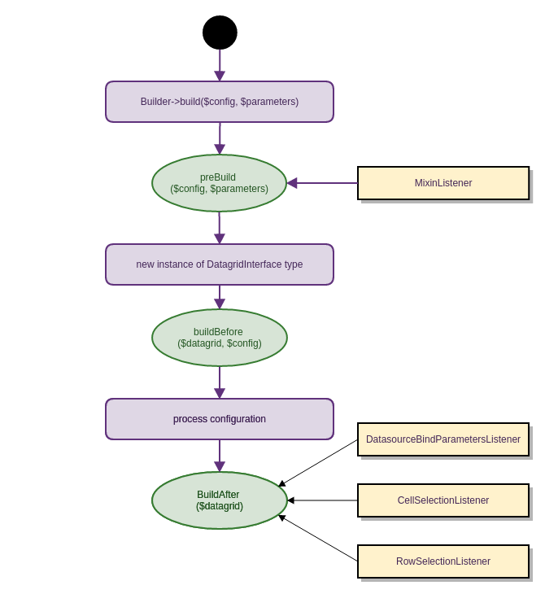
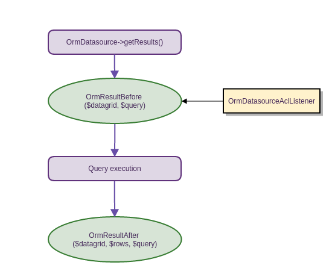

Customizing data grids in OroCommerce
=====================================

Most business application users have to deal with significant amounts of data on daily basis. Thus efficient navigation through large data sets becomes a must have requirement, and OroCommerce is not an exception. The application users must be able to easily filter, sort and search through thousands (or millions) of records, usually represented in the form of a data grid on a page. 

Today we will focus on customizing the existing data grids provided by the core product. If you not familiar with OroPlatform data grids, you may find it helpful to check the Oro Cookbook articles on [how to create a simple data grid](https://www.orocrm.com/documentation/index/current/cookbook/entities/datagrid), and [how to pass request parameters to your data grid](https://www.orocrm.com/documentation/index/current/cookbook/how-to-pass-request-parameter-to-grid). The [datagrid.yml configuration reference](https://www.orocrm.com/documentation/index/current/reference/format/datagrid) and [OroDataGridBundle documentation](https://github.com/orocrm/platform/tree/master/src/Oro/Bundle/DataGridBundle/Resources/doc) contain additional useful information.  

Data Sources
------------

A data grid is usually used to visualize some data coming from a data source. OroDataGridBundle allows for use of various data source for data grids, and includes the ORM data source adapter out of the box. It is possible to [implement your own data source adapters](https://github.com/orocrm/platform/blob/master/src/Oro/Bundle/DataGridBundle/Resources/doc/backend/datasources.md) as well. 

The ORM data source types allow for database query specification, sorters and filters definitions to be specified in the data grid configuration. Data grid configuration can be supplied by a developer in YAML format. By convention, the datagrid.yml files placed in Resources/config folders of any application bundle are processed automatically. All supported data source configuration options that can be used in data source configuration section are described in the [documentation](https://github.com/orocrm/platform/blob/master/src/Oro/Bundle/DataGridBundle/Resources/doc/backend/datasources.md).

Inner Workings of Data Grids
----------------------------

Data grids in Oro applications are highly customizable. It is possible to modify an existing grid in order to fetch more data than was originally defined in the grid configuration. In this article we will retrieve and present to a user some additional data in the existing [products-grid](https://github.com/laboro/dev/blob/56a4044c13cde93a31dfaac373de428962a13f56/package/commerce/src/OroB2B/Bundle/ProductBundle/Resources/config/datagrid.yml#L101).

And before we start customizing it, let's take a deeper look into two aspects of how the data grids actually work:
* building and configuring a new DataGrid instance
* fetching data

### Building Grids


Datagrid\Builder class is responsible for creating and configuring a data grid object and its data source. This is how the ``build`` method is processing the grid configuration internally:



Imagine that you need to add show a list of related price lists for every product record in the `product grid`. You want it to be displayed in a separate column with a multi-select filter. Also you want to add one more column to display owner of each of the product records.

One of the possible ways to do customize this grid would be through events triggered by the system during the grid build process and when the data is fetched from the data source.

There are several events triggered before processing the data grid configuration files. In this case good choice is ```onBuildBefore``` event. By listening to this event you can add new elements to the grid configuration or modify already existing configuration in your event listener.

> More information about grid column definition configuration options is available in the [documentation](https://github.com/orocrm/platform/blob/master/src/Oro/Bundle/DataGridBundle/Resources/doc/backend/datagrid.md#columns-and-properties)

The `Product` entity has ``manyToOne`` relation with `Business Unit` entity, so in order to add the ``owner`` column to the grid and load the owner data from the data source you should modify its query configuration by adding additional `join` and `select` parts.

### Fetching Data

However, the retrieving data for the ``price lists`` column is a little bit more complicated, because the `Product` entity has ``manyToMany`` relation with price lists, and the  ``join`` result will contain duplicate rows. In such situations or when some other dynamic data should be included into the query results, a possible solution would be data modification after the rows were fetched from the data source.

This is how the data retrieval works in general:




So in our customization, we will fetch the price list data in a separate query, and then we will attach this data to each of the product records in the grid.

Product Grid Customization
--------------------------

The resulting implementation of the ``ProductsGridListener`` may look similar to this example: 

```
class ProductsGridListener
{
   ... 
   
   /**
    * @param BuildBefore $event
    */
   public function onBuildBefore(BuildBefore $event)
   {
       $datagridConfiguration = $event->getConfig();
       $this->addBusinessUnitColumn($datagridConfiguration);
       $this->addPriceListsColumn($datagridConfiguration);
   }

   /**
    * @param OrmResultAfter $event
    */
   public function onResultAfter(OrmResultAfter $event)
   {
       $records = $event->getRecords();
       $this->addPriceListsToRecords($records);
   }

   /**
    * @param DatagridConfiguration $datagridConfiguration
    */
   protected function addPriceListsColumn(DatagridConfiguration $datagridConfiguration)
   {
       $column = [
           'label' => 'Price Lists',
           'type' => 'twig',
           'template' => 'OroB2BPricingBundle:Datagrid:Column/price_lists.html.twig',
           'frontend_type' => 'html',
           'renderable' => true,
       ];
       $datagridConfiguration->addColumn('price_lists', $column);
   }

   /**
    * @param DatagridConfiguration $datagridConfiguration
    */
   protected function addBusinessUnitColumn(DatagridConfiguration $datagridConfiguration)
   {
       $datagridConfiguration->joinTable(
           'left',
           [
               'join' => BusinessUnit::class,
               'alias' => 'business_unit',
               'conditionType' => 'WITH',
               'condition' => 'product.owner = business_unit',
           ]
       );

       $column = [
           'label' => 'Owner'
       ];

       // column name should be ther same as the field alias in the select query
       $datagridConfiguration->addColumn('owner', $column, 'business_unit.name as owner');
   }

   /**
    * @param ResultRecord[] $records
    * @throws \Doctrine\ORM\ORMException
    */
   protected function addPriceListsToRecords(array $records)
   {
       $repository = $this->registry->getRepository(PriceListToProduct::class);
       /** @var EntityManager $objectManager */
       $objectManager = $this->registry->getManager();

       $products = [];
       foreach ($records as $record) {
           $products[] = $objectManager->getReference(Product::class, $record->getValue('id'));
       }

       $priceLists = [];
       foreach ($repository->findBy(['product' => $products]) as $item) {
           $priceLists[$item->getProduct()->getId()][] = $item->getPriceList();
       }

       /** @var ResultRecord $record */
       foreach ($records as $record) {
           $id = $record->getValue('id');
           $products[] = $objectManager->getReference(Product::class, $id);

           $record->addData(['price_lists' => $priceLists[$id]]);
       }
   }
}
```

We will need to register this event listener in the service container:

```
grid_event_listener.product:
    class: 'Oro\Bundle\CustomGridBundle\Datagrid\ProductsGridListener'
    arguments:
        - @doctrine
    tags:
        - { name: kernel.event_listener, event: oro_datagrid.datagrid.build.before.products-grid, method: onBuildBefore }
        - { name: kernel.event_listener, event: oro_datagrid.orm_datasource.result.after.products-grid, method: onResultAfter }
```

After the application cache is refreshed (or immediately in the dev mode) two new columns will appear in the product grid.

Custom Filters
--------------

Our second customization task will be to add filters for the newly introduced column.

In most cases the [built-in filters](https://github.com/orocrm/platform/blob/master/src/Oro/Bundle/FilterBundle/Resources/doc/reference/filter_form_types.md) would work just perfectly. But in the case of the `price lists` column a custom filter is required. The purpose of this filter will be to modify the data retrieval query depending on the filter values entered by a user.

```
class ProductPriceListsFilter extends EntityFilter
{
    /**
     * @var RegistryInterface
     */
    protected $registry;

    /**
     * @inheritdoc
     */
    public function apply(FilterDatasourceAdapterInterface $ds, $data)
    {
        /** @var array $data */
        $data = $this->parseData($data);
        if (!$data) {
            return false;
        }

        $this->restrictByPriceList($ds, $data['value']);

        return true;
    }

    /**
     * @param RegistryInterface $registry
     */
    public function setRegistry(RegistryInterface $registry)
    {
        $this->registry = $registry;
    }

    /**
     * @param OrmFilterDatasourceAdapter|FilterDatasourceAdapterInterface $ds
     * @param array $priceLists
     */
    public function restrictByPriceList($ds, array $priceLists)
    {
        $queryBuilder = $ds->getQueryBuilder();
        $parentAlias = $queryBuilder->getRootAliases()[0];
        $parameterName = $ds->generateParameterName('price_lists');

        $repository = $this->registry->getRepository(PriceListToProduct::class);
        $subQueryBuilder = $repository->createQueryBuilder('relation');
        $subQueryBuilder->where(
            $subQueryBuilder->expr()->andX(
                $subQueryBuilder->expr()->eq('relation.product', $parentAlias),
                $subQueryBuilder->expr()->in('relation.priceList', ":$parameterName")
            )
        );

        $queryBuilder->andWhere($subQueryBuilder->expr()->exists($subQueryBuilder->getQuery()->getDQL()));
        $queryBuilder->setParameter($parameterName, $priceLists);
    }
}
```

Our new filter should be registered in the service container with the ``oro_filter.extension.orm_filter.filter`` tag:

```
grid_filter.price_lists:
    class: 'Oro\Bundle\CustomGridBundle\Filter\ProductPriceListsFilter'
    public: false
    arguments:
        - '@form.factory'
        - '@oro_filter.filter_utility'
    calls:
        - [setRegistry, ['@doctrine']]
    tags:
        - { name: oro_filter.extension.orm_filter.filter, type: product-price-lists }
```


This filter can be added to the grid configuration similarly to how we added new columns - in an event listener. Thus the final implementation of the ``ProductsGridListener`` would look like this:

```
class ProductsGridListener
{
    /**
     * @var RegistryInterface
     */
    protected $registry;

    /**
     * @param RegistryInterface $registry
     */
    public function __construct(RegistryInterface $registry)
    {
        $this->registry = $registry;
    }

    /**
     * @param BuildBefore $event
     */
    public function onBuildBefore(BuildBefore $event)
    {
        $datagridConfiguration = $event->getConfig();
        $this->addBusinessUnitColumn($datagridConfiguration);
        $this->addPriceListsColumn($datagridConfiguration);
        $this->addPriceListsFilter($datagridConfiguration);
    }

    /**
     * @param OrmResultAfter $event
     */
    public function onResultAfter(OrmResultAfter $event)
    {
        $records = $event->getRecords();
        $this->addPriceListsToRecords($records);
    }

    /**
     * @param DatagridConfiguration $datagridConfiguration
     */
    protected function addPriceListsColumn(DatagridConfiguration $datagridConfiguration)
    {
        $column = [
            'label' => 'Price Lists',
            'type' => 'twig',
            'template' => 'OroCustomGridBundle:Datagrid:Column/price_lists.html.twig',
            'frontend_type' => 'html',
            'renderable' => true,
        ];
        $datagridConfiguration->addColumn('price_lists', $column);
    }

    /**
     * @param DatagridConfiguration $datagridConfiguration
     */
    protected function addBusinessUnitColumn(DatagridConfiguration $datagridConfiguration)
    {
        $datagridConfiguration->joinTable(
            'left',
            [
                'join' => BusinessUnit::class,
                'alias' => 'business_unit',
                'conditionType' => 'WITH',
                'condition' => 'product.owner = business_unit',
            ]
        );

        $column = [
            'label' => 'Owner'
        ];

        // column name should be ther same as the field alias in the select query
        $datagridConfiguration->addColumn('owner', $column, 'business_unit.name as owner');
    }

    /**
     * @param DatagridConfiguration $datagridConfiguration
     */
    protected function addPriceListsFilter(DatagridConfiguration $datagridConfiguration)
    {
        $filter = [
            'type' => 'product-price-lists',
            'data_name' => 'price_lists',
            'options' => [
                'field_type' => 'entity',
                'field_options' => [
                    'class' => PriceList::class,
                    'property' => 'name',
                    'multiple' => true
                ]
            ]
        ];

        $datagridConfiguration->addFilter('price_lists', $filter);
    }

    /**
     * @param ResultRecord[] $records
     * @throws \Doctrine\ORM\ORMException
     */
    protected function addPriceListsToRecords(array $records)
    {
        $repository = $this->registry->getRepository(PriceListToProduct::class);
        /** @var EntityManager $objectManager */
        $objectManager = $this->registry->getManager();

        $products = [];
        foreach ($records as $record) {
            $products[] = $objectManager->getReference(Product::class, $record->getValue('id'));
        }

        $priceLists = [];
        foreach ($repository->findBy(['product' => $products]) as $item) {
            $priceLists[$item->getProduct()->getId()][] = $item->getPriceList();
        }

        /** @var ResultRecord $record */
        foreach ($records as $record) {
            $id = $record->getValue('id');
            $products[] = $objectManager->getReference(Product::class, $id);

            $record->addData(['price_lists' => $priceLists[$id]]);
        }
    }
}

```
Please let us know if you find this article useful. The full code example in a form of a custom bundle can be downloaded at [download link will be here]. We hope it can help the developers in the OroCommerce community to further improve user experience and make dealing with data even more enjoyable and fun. We will appreciate your feedback in our [forum](https://www.orocommerce.com/forums).
